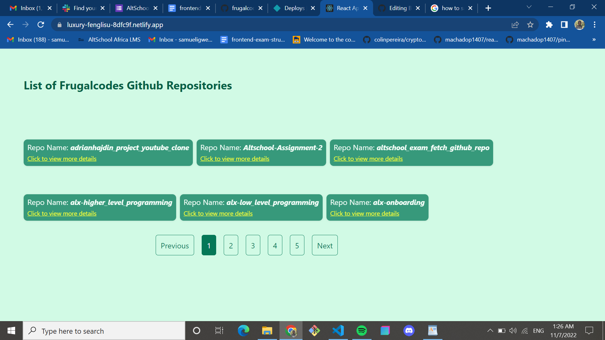

<!-- Improved compatibility of back to top link: See: https://github.com/othneildrew/Best-README-Template/pull/73 -->
<a name="Github Repository Fetch App"></a>


<!-- PROJECT LOGO -->
<br />


  <h3 align="center">Altschool Exam Project</h3>

  <p align="center">
    An app that fetches list and details of repository of frugalcodes
    <br />
    <a href="https://github.com/frugalcodes/altschool_exam_fetch_github_repo"><strong>Explore the docs »</strong></a>
    <br />
    <br />
    <a href="https://luxury-fenglisu-8dfc9f.netlify.app/">View Demo</a>
    ·
    <a href="https://github.com/frugalcodes/altschool_exam_fetch_github_repo/issues">Report Bug</a>
    ·
    <a href="https://github.com/frugalcodes/altschool_exam_fetch_github_repo/issues">Request Feature</a>
  </p>
</div>


<!-- TABLE OF CONTENTS -->
<details>
  <summary>Table of Contents</summary>
  <ol>
    <li>
      <a href="#about-the-project">About The Project</a>
      <ul>
        <li><a href="#built-with">Built With</a></li>
      </ul>
    </li>
    <li>
      <a href="#getting-started">Getting Started</a>
      <ul>
        <li><a href="#prerequisites">Prerequisites</a></li>
        <li><a href="#installation">Installation</a></li>
      </ul>
    </li>
    <li><a href="#usage">Usage</a></li>
    <li><a href="#roadmap">Roadmap</a></li>
    <li><a href="#contributing">Contributing</a></li>
    <li><a href="#license">License</a></li>
    <li><a href="#contact">Contact</a></li>
    <li><a href="#acknowledgments">Acknowledgments</a></li>
  </ol>
</details>


<!-- ABOUT THE PROJECT -->
## About The Project

<div align="center">
  <a href="https://github.com/frugalcodes/altschool_exam_fetch_github_repo">
    
  </a>

This Project Use Github api to fetch the repository information of Frugalcodes


<p align="right">(<a href="#readme-top">back to top</a>)</p>


### Built With


* REACTJS


<p align="right">(<a href="#readme-top">back to top</a>)</p>


### Prerequisites

  ```sh
  npm install npm@latest -g
  ```

### Installation


1. Get a free API Key at [https://docs.github.com/en/rest/overview]https://docs.github.com/en/rest/overview)
2. Clone the repo
   ```sh
   git clone https://github.com/your_username_/Project-Name.git
   ```
3. Install NPM packages
   ```sh
   npm install
   ```
4. Enter your API in `config.js`
   ```js
   const API_KEY = 'ENTER YOUR API';
   ```

<p align="right">(<a href="#readme-top">back to top</a>)</p>


<!-- USAGE EXAMPLES -->
## Usage

_For more examples, please refer to the [Documentation](https://api.github.com/)_

<p align="right">(<a href="#readme-top">back to top</a>)</p>


See the [open issues](https://github.com/othneildrew/Best-README-Template/issues) for a full list of proposed features (and known issues).

<p align="right">(<a href="#readme-top">back to top</a>)</p>


<!-- CONTRIBUTING -->
## Contributing
                                                                                                                                                                                                                                                                
Don't forget to give the project a star! Thanks again!

1. @Oluwasetemi

<p align="right">(<a href="#readme-top">back to top</a>)</p>


<!-- LICENSE -->
## License

Distributed under the MIT License. See `LICENSE.txt` for more information.

<p align="right">(<a href="#readme-top">back to top</a>)</p>


<!-- CONTACT -->
## Contact

Your Name - [@Frugalcodes](https://twitter.com/frugalcodes) - email@example.com

Project Link: [https://github.com/frugalcodes/altschool_exam_fetch_github_repo](https://github.com/frugalcodes/altschool_exam_fetch_github_repo/)

<p align="right">(<a href="#readme-top">back to top</a>)</p>


<!-- ACKNOWLEDGMENTS -->
## Acknowledgments


* [Github Api](https://docs.github.com/en/rest)

* [Altschool](https://thealtschool.com/)

<p align="right">(<a href="#readme-top">back to top</a>)</p>


<!-- MARKDOWN LINKS & IMAGES -->
<!-- https://www.markdownguide.org/basic-syntax/#reference-style-links -->
[contributors-shield]: https://img.frugalcodes.io/github/contributors/frugalcodesw/altschool_exam_fetch_github_repo.svg?style=for-the-badge
[contributors-url]: https://github.com/frugalcodes/altschool_exam_fetch_github_repo/graphs/contributors
[forks-shield]: https://img.frugalcodes.io/github/forks/frugalcodes/altschool_exam_fetch_github_repo/
[forks-url]: https://github.com/frugalcodes/altschool_exam_fetch_github_repo//network/members
[stars-shield]: https://img.frugalcodes.io/github/stars/frugalcodes/altschool_exam_fetch_github_repo.svg?style=for-the-badge
[stars-url]: https://github.com/frugalcodes/altschool_exam_fetch_github_repo/stargazers
[issues-shield]: https://img.frugalcodes.io/github/issues/othneildrew/Best-README-Template.svg?style=for-the-badge
[issues-url]: https://github.frugalcodes/altschool_exam_fetch_github_repo/issues
[license-shield]: https://img.frugalcodes.io/github/license/othneildrew/altschool_exam_fetch_github_repo.svg?style=for-the-badge

[linkedin-shield]: https://img.frugalcodes.io/badge/-LinkedIn-black.svg?style=for-the-badge&logo=linkedin&colorB=555
[linkedin-url]: https://www.linkedin.com/in/samuel-igwe-031152226/
[React.js]: https://img.frugalcodes.io/badge/React-20232A?style=for-the-badge&logo=react&logoColor=61DAFB
[React-url]: https://reactjs.org/

